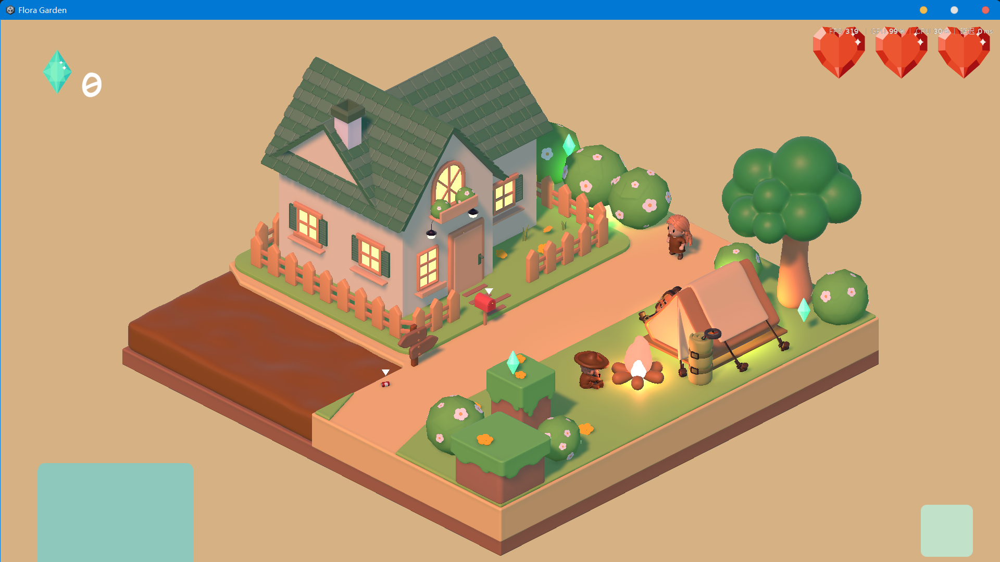
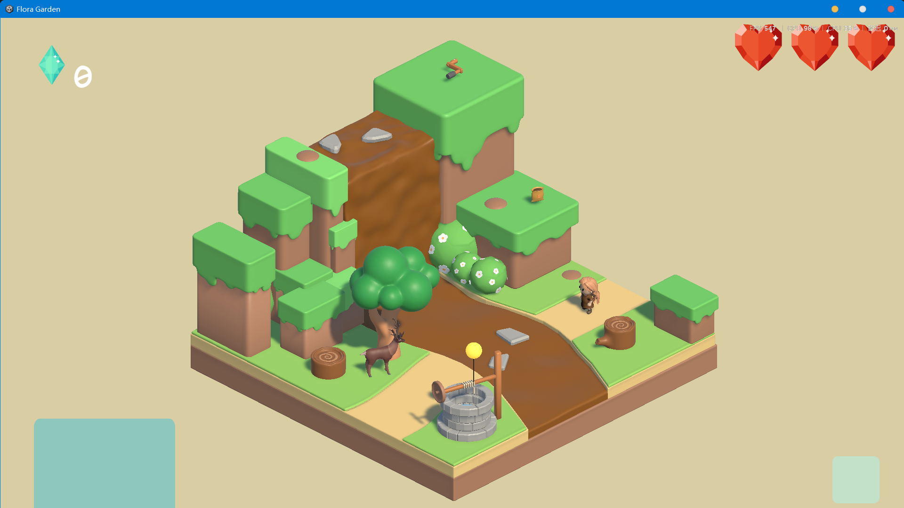
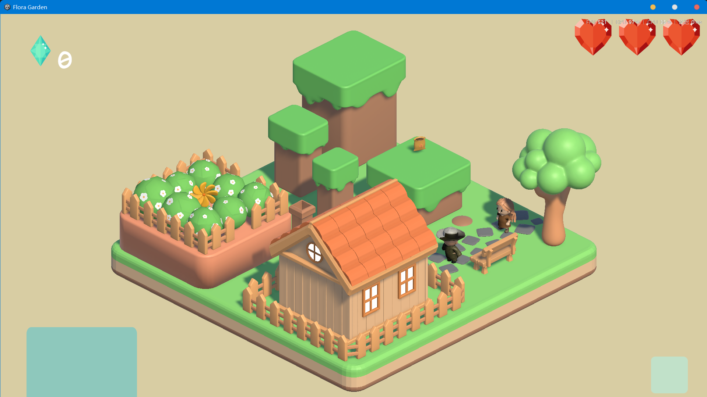

# Flora's Garden

Flora's Garden is a Unity game demo set in a garden environment. This repository contains the Windows build, a three-part gameplay demo video, and screenshots that show the visual quality of the game.

## Gameplay Demo

The gameplay demo is split into three consecutive video files because of GitHub upload and loading limits. Watch them in order for the full demo.

1. [Gameplay demo - Part 1](Display%20video0.mp4)
1. [Gameplay demo - Part 2](Display%20video1.mp4)
2. [Gameplay demo - Part 3](Display%20video2.mp4)
3. [Gameplay demo - Part 4](Display%20video3.mp4)

The videos are compressed for repository size. For a clearer look at the game's visual quality, see the screenshots below.

## Visual Quality Screenshots







## Run

Download or clone the repository, then run:

```text
Flora Garden.exe
```

Keep the following Unity runtime files and folders in the same directory as the executable:

- `Flora Garden_Data/`
- `MonoBleedingEdge/`
- `D3D12/`
- `UnityPlayer.dll`
- `UnityCrashHandler64.exe`

## Repository Contents

- `Flora Garden.exe` - Windows executable
- `Flora Garden_Data/` - Unity game data
- `Display video1.mp4`, `Display video2.mp4`, `Display video3.mp4` - consecutive compressed gameplay demo videos
- `screenShot1.png`, `screenShot2.png`, `screenShot3.png` - visual quality screenshots
